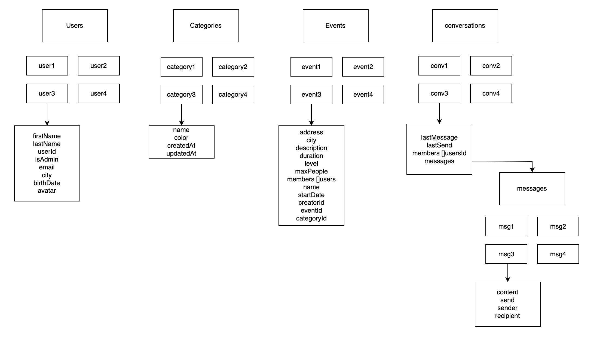
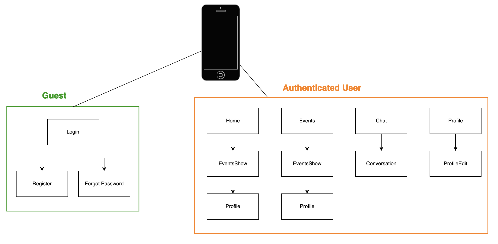
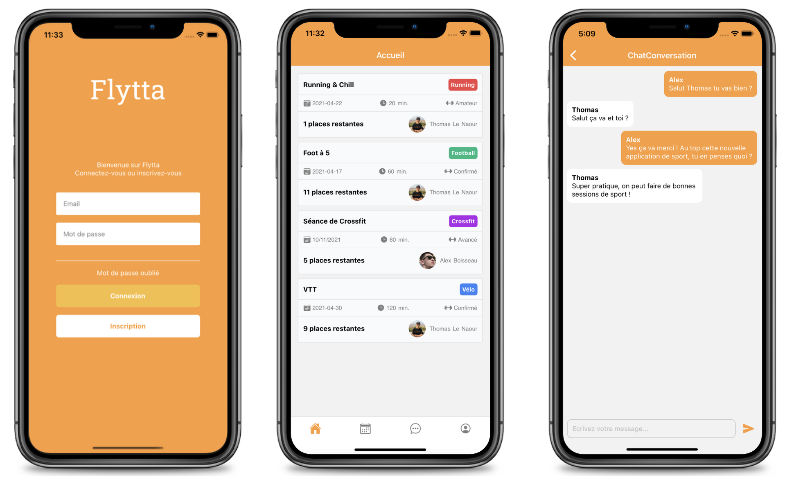
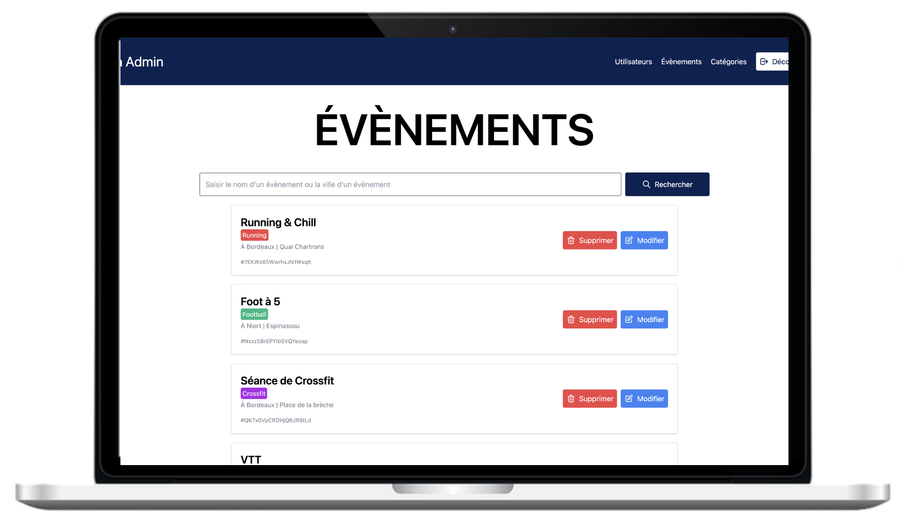

# Flytta

**Projet UF &bull; Bachelor 3 (Bordeaux Ynov Campus)**  
_Alex BOISSEAU - Thomas LE NAOUR_

**Flytta** est une application d'événements sportifs utilisée par la communauté des Flytters.

## Utilisation

```sh
git clone https://github.com/alexboisseau/flytta
cd flytta/admin-dashboard
yarn # ou npm install
yarn start # pour lancer l'administration
cd ../Application
yarn # ou npm install
yarn start # ou npm start
```

## Technologies utilisées


## Fonctionnalités principales

- Authentification (connexion / inscription / mot de passe oublié)
- Gestion des événements & des membres
- Gestion du profil (avatar, modification)
- Système de chat entre utilisateurs
- CRUD de toutes les entités sur l'administration

## Base de données

**NoSQL, Firebase**



## Architecture de l'application



## Captures d'écran

### Application



### Administration


